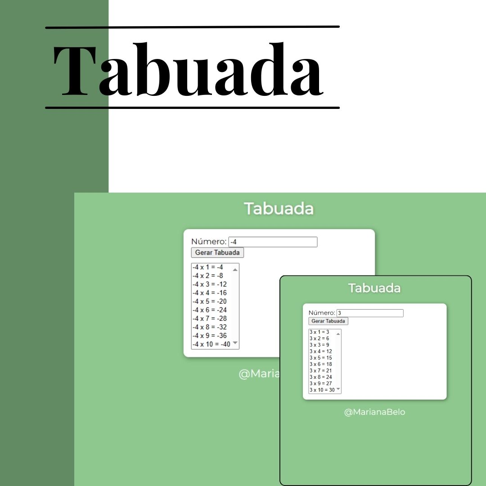

<h1 align="center">Repositório de JavaScript</h1>

 ## 📲 Acesse
 
 <strong>Minhas redes:</strong>
 
 <a href='https://linkedin.com/in/marianabelo26/' target='_blank'>LinkedIn</a>
  
 <a href='https://instagram.com/mariana_.belo' target='_blank'>Instagram</a>
 
<h2>Conheça meus projetos</h2>

<h3 align="center">Projeto <a href='https://marianabelo26.github.io/javascript/dev-links/index.html' target='_blank'>Dev Links</a></h3>

  

## 💻 Projeto

O DevLinks é um agregador de links para usar como cartão de visitas online, desenvolvido durante o curso da Rocketseat.

<h3 align="center">Projeto <a href='https://marianabelo26.github.io/html-css/hora-do-dia/index.html' target='_blank'>Hora do Dia</a></h3>

  

## 💻 Projeto

O Hora do Dia é um site que mostra a hora em tempo real ao usuário, mudando a cor do fundo da tela e a imagem conforme manhã, tarde e noite, desenvolvido durante o curso de JavaScript do Curso em Video.

<h3 align="center">Projeto  <a href='https://marianabelo26.github.io/html-css/verificador-de-idade/index.html' target='_blank'>Verificador de Idade</a></h3>

  

## 💻 Projeto

Verificador de Idade é um site com desenvolvimento de para calcular a idade do usuário, e mudar a imagem apresentada conforme a idade e o sexo do utilizador do site, desenvolvido durante o curso de HTML5 e CSS3 do Curso em Video.

<h3 align="center">Projeto  <a href='https://marianabelo26.github.io/html-css/contador/index.html' target='_blank'>Contador</a></h3>

  

## 💻 Projeto

Contador é um site que conta os números e os apresenta na tela, mostrando alertas de erro para o usuário caso ele não adicione todos os dados, desenvolvido durante o curso de HTML5 e CSS3 do Curso em Video.

<h3 align="center">Projeto  <a href='https://marianabelo26.github.io/html-css/tabuada/index.html' target='_blank'>Tabuada</a></h3>

  

## 💻 Projeto

Tabuada é um site com desenvolvimento de para calcular a tabuada a partir do número digitado pelo usuário, mostrando alertas de erro para o usuário caso ele não adicione todos os dados, desenvolvido durante o curso de HTML5 e CSS3 do Curso em Video.

 

## 🚀 Tecnologias

Esses projetos foram desenvolvidos com as seguintes tecnologias:

-JavaScript
- HTML
- CSS
- Git e Github
- Figma
